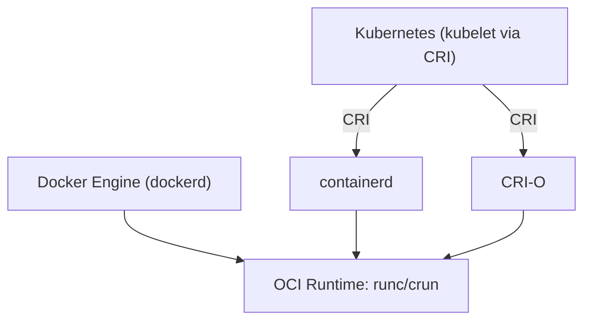

```mermaid
flowchart TB
    Docker["Docker Engine (dockerd)"]
    containerd["containerd"]
    crio["CRI-O"]
    runc["OCI Runtime: runc/crun"]
    k8s["Kubernetes (kubelet via CRI)"]

    Docker --> runc
    containerd --> runc
    crio --> runc
    k8s -->|CRI| containerd
    k8s -->|CRI| crio

```