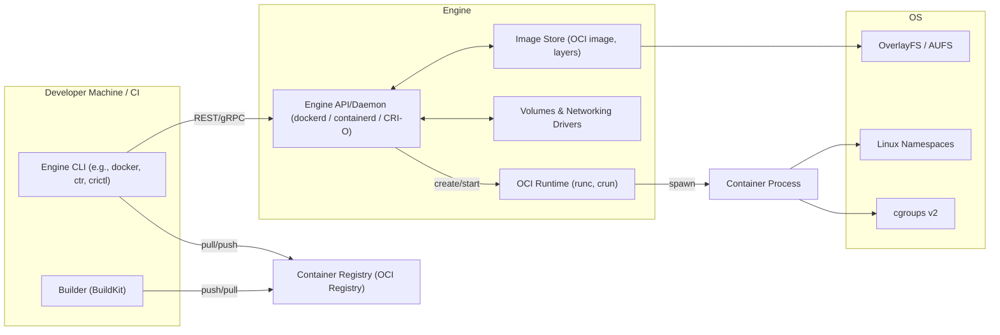

```mermaid
flowchart LR
    subgraph Developer Machine / CI
      CLI["Engine CLI (e.g., docker, ctr, crictl)"]
      Build["Builder (BuildKit)"]
    end

    subgraph Engine
      API["Engine API/Daemon (dockerd / containerd / CRI-O)"]
      ImgStore["Image Store (OCI image, layers)"]
      VolNet["Volumes & Networking Drivers"]
      RT["OCI Runtime (runc, crun)"]
    end

    subgraph OS
      NS["Linux Namespaces"]
      CG["cgroups v2"]
      FS["OverlayFS / AUFS"]
    end

    Reg["Container Registry (OCI Registry)"]
    Ctr["Container Process"]

    CLI -->|REST/gRPC| API
    Build -->|push/pull| Reg
    API <--> ImgStore
    API <--> VolNet
    API -->|create/start| RT
    RT -->|spawn| Ctr
    Ctr --> NS
    Ctr --> CG
    ImgStore --> FS
    CLI -->|pull/push| Reg


```