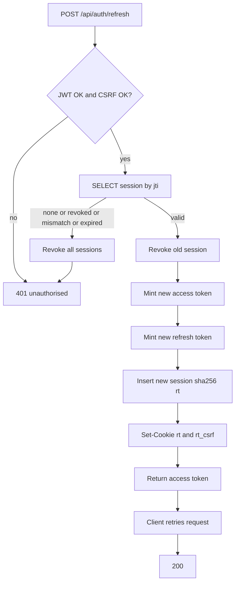

```mermaid
flowchart TD
  A[POST /api/auth/refresh]
  A --> B{JWT OK and CSRF OK?}
  B -->|no| Z[401 unauthorised]
  B -->|yes| C[SELECT session by jti]
  C -->|none or revoked or mismatch or expired| R[Revoke all sessions]
  R --> Z
  C -->|valid| D[Revoke old session]
  D --> E[Mint new access token]
  E --> F[Mint new refresh token]
  F --> G[Insert new session sha256 rt]
  G --> H[Set-Cookie rt and rt_csrf]
  H --> I[Return access token]
  I --> J[Client retries request]
  J --> K[200]


```