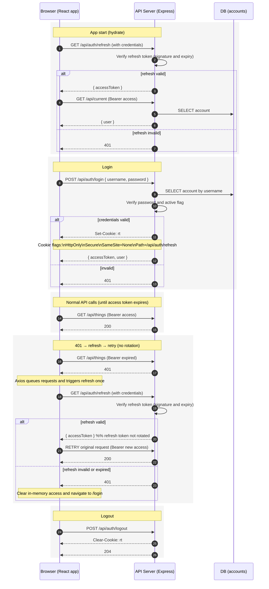

```mermaid
sequenceDiagram
  autonumber
  participant B as Browser (React app)
  participant A as API Server (Express)
  participant D as DB (accounts)

  rect rgb(245,245,245)
  Note over B,A: App start (hydrate)
  B->>A: GET /api/auth/refresh (with credentials)
  A->>A: Verify refresh token (signature and expiry)
  alt refresh valid
    A-->>B: { accessToken }
    B->>A: GET /api/current (Bearer access)
    A->>D: SELECT account
    A-->>B: { user }
  else refresh invalid
    A-->>B: 401
  end
  end

  rect rgb(245,245,245)
  Note over B,A: Login
  B->>A: POST /api/auth/login { username, password }
  A->>D: SELECT account by username
  A->>A: Verify password and active flag
  alt credentials valid
    A-->>B: Set-Cookie: rt
    Note over A,B: Cookie flags:\nHttpOnly\nSecure\nSameSite=None\nPath=/api/auth/refresh
    A-->>B: { accessToken, user }
  else invalid
    A-->>B: 401
  end
  end

  rect rgb(245,245,245)
  Note over B,A: Normal API calls (until access token expires)
  B->>A: GET /api/things (Bearer access)
  A-->>B: 200
  end

  rect rgb(245,245,245)
  Note over B,A: 401 → refresh → retry (no rotation)
  B->>A: GET /api/things (Bearer expired)
  A-->>B: 401
  Note over B: Axios queues requests and triggers refresh once
  B->>A: GET /api/auth/refresh (with credentials)
  A->>A: Verify refresh token (signature and expiry)
  alt refresh valid
    A-->>B: { accessToken }  %% refresh token not rotated
    B->>A: RETRY original request (Bearer new access)
    A-->>B: 200
  else refresh invalid or expired
    A-->>B: 401
    Note over B: Clear in-memory access and navigate to /login
  end
  end

  rect rgb(245,245,245)
  Note over B,A: Logout
  B->>A: POST /api/auth/logout
  A-->>B: Clear-Cookie: rt
  A-->>B: 204
  end


```