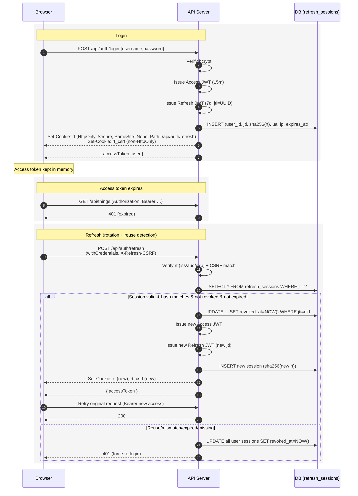

```mermaid
sequenceDiagram
  autonumber
  participant B as Browser
  participant A as API Server
  participant D as DB (refresh_sessions)

  rect rgb(245,245,245)
  Note over B,A: Login
  B->>A: POST /api/auth/login {username,password}
  A->>A: Verify bcrypt
  A->>A: Issue Access JWT (15m)
  A->>A: Issue Refresh JWT (7d, jti=UUID)
  A->>D: INSERT (user_id, jti, sha256(rt), ua, ip, expires_at)
  A-->>B: Set-Cookie: rt (HttpOnly, Secure, SameSite=None, Path=/api/auth/refresh)<br/>Set-Cookie: rt_csrf (non-HttpOnly)
  A-->>B: { accessToken, user }
  end

  Note over B: Access token kept in memory

  rect rgb(245,245,245)
  Note over B,A: Access token expires
  B->>A: GET /api/things (Authorization: Bearer …)
  A-->>B: 401 (expired)
  end

  rect rgb(245,245,245)
  Note over B,A: Refresh (rotation + reuse detection)
  B->>A: POST /api/auth/refresh<br/>(withCredentials, X-Refresh-CSRF)
  A->>A: Verify rt (iss/aud/exp) + CSRF match
  A->>D: SELECT * FROM refresh_sessions WHERE jti=?
  alt Session valid & hash matches & not revoked & not expired
    A->>D: UPDATE ... SET revoked_at=NOW() WHERE jti=old
    A->>A: Issue new Access JWT
    A->>A: Issue new Refresh JWT (new jti)
    A->>D: INSERT new session (sha256(new rt))
    A-->>B: Set-Cookie: rt (new), rt_csrf (new)
    A-->>B: { accessToken }
    B->>A: Retry original request (Bearer new access)
    A-->>B: 200
  else Reuse/mismatch/expired/missing
    A->>D: UPDATE all user sessions SET revoked_at=NOW()
    A-->>B: 401 (force re-login)
  end
  end
```